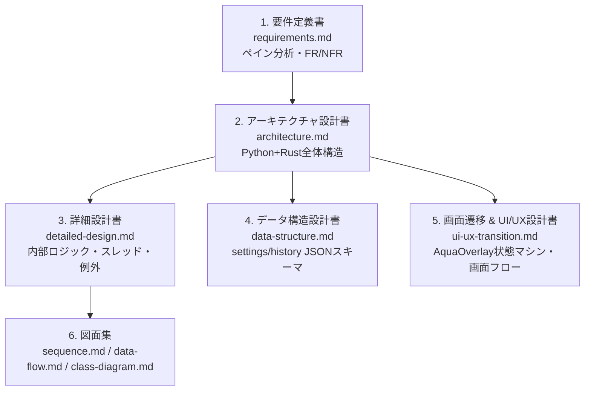

# Voice In (Linux / Cross-Platform) - 総合エンジニアリング仕様書一覧

Voice In は、Linux をはじめとするデスクトップ環境における「日本語音声入力アプリの不在」「OSデフォルト音声認識のフィラー混入・精度不足」というペインを解決するために開発された、**Python (PyQt6) ＋ Rust (cpal) ハイブリッド構成の思考直結型・音声入力アシスタント**です。

本ディレクトリ (`Doc/`) は、上流工程（ヒアリング・要求分析・ペインの言語化）から、要件定義、システム設計、詳細設計、UI/UX設計、データモデリングまでを一貫して体系化した技術仕様書群です。

---

## 📚 ドキュメント体系一覧

| 分類 | ドキュメント | 主な内容 |
| :--- | :--- | :--- |
| **要件定義** | **[システム要件定義書 (requirements.md)](requirements.md)** | 開発背景、ユーザーペイン（3大課題）、要求分析、業務フロー（As-Is/To-Be）、機能要件 (FR-001〜015)、非機能要件 (NFR-001〜010) |
| **基本設計** | **[アーキテクチャ設計書 (architecture.md)](architecture.md)** | Python + Rust ハイブリッド構造、Maturin/PyO3連携、4スレッド分離モデル、技術選定理由 |
| **詳細設計** | **[詳細設計書 (detailed-design.md)](detailed-design.md)** | モジュール責務一覧、コンテキスト認識（単語境界マッチング）、AIProviderFactory、例外ツリー、スレッド競合防止 |
| **UI/UX設計**| **[画面遷移 & UI/UX設計書 (ui-ux-transition.md)](ui-ux-transition.md)** | ゼロクリック体験、AquaOverlay 状態マシン（5状態）、全体画面遷移図、Settings/Wizard/History 画面仕様 |
| **データ設計**| **[データ構造 & モデリング設計書 (data-structure.md)](data-structure.md)** | `settings.json` 完全スキーマ、`history.json` リングバッファ（Atomic Write）、`.env` 環境変数、メモリ内モデル |
| **フロー設計**| **[データフロー図 (data-flow.md)](data-flow.md)** | Level 0 / Level 1 DFD、コンテキスト認識データパイプライン |
| **時系列設計**| **[シーケンス図集 (sequence.md)](sequence.md)** | 録音〜Rust VAD〜AI推論〜自動貼付の時系列フロー、無音スキップ、初期ウィザード |
| **構造設計** | **[クラス構造設計書 (class-diagram.md)](class-diagram.md)** | 全体クラス図 (Mermaid)、Python/Rust間の責務分担、Provider抽象化 |

---

## 🎯 要求・設計・実装トレーサビリティマトリクス

上流の要求・ペインがどの設計・実装ファイル・単体テストに対応しているかを明示する。

| 課題・ペイン | 対応要件ID | 設計ドキュメント | 主な実装コード | 単体テスト |
| :--- | :---: | :--- | :--- | :--- |
| **フィラーの混入、誤変換、専門用語のカタカナ化** | FR-004 FR-005 FR-008 | [requirements.md](requirements.md) [detailed-design.md](detailed-design.md) | `src/ai/providers/gemini.py` `src/ai/providers/groq.py` `src/core/const.py` | `tests/test_ai_factory.py` |
| **作業アプリごとに文体を変えたい（コード/メール/メモ）** | FR-007 | [requirements.md](requirements.md) [detailed-design.md](detailed-design.md) | `src/core/context_prompt.py` `src/core/window_detector.py` | `tests/test_context_prompt.py` |
| **キー長押しだけで思考を遮らず即入力したい** | FR-001 FR-010 | [requirements.md](requirements.md) [ui-ux-transition.md](ui-ux-transition.md) | `src/ui/overlay.py` `src/ui/styles.py` | - |
| **Linux で確実かつ低遅延に自動貼り付けしたい** | FR-002 FR-003 FR-009 | [requirements.md](requirements.md) [architecture.md](architecture.md) | `src/audio/recorder.py` `rust_core/src/recorder.rs` `src/ui/overlay.py` | - |
| **機密情報・オフライン環境で完全ローカル推論したい** | FR-006 NFR-007 | [requirements.md](requirements.md) [architecture.md](architecture.md) | `src/ai/providers/local.py` | `tests/test_ai_factory.py` |
| **設定・履歴の二重管理排除・破損耐性** | NFR-004 NFR-009 | [data-structure.md](data-structure.md) [detailed-design.md](detailed-design.md) | `src/core/config.py` `src/core/history.py` `src/core/const.py` | `tests/test_config.py` `tests/test_history.py` |

---

## 🛠️ 開発者向けクイックリンク
- [メイン README.md (プロジェクト概要・使い方)](../README.md)
- [リファクタリング報告書 (リファクタ.md)](../リファクタ.md)
- [イシュー管理サマリー (issues/ISSUE_SUMMARY.md)](../issues/ISSUE_SUMMARY.md)
- [開発環境セットアップ (SETUP_UV.md)](../SETUP_UV.md)
