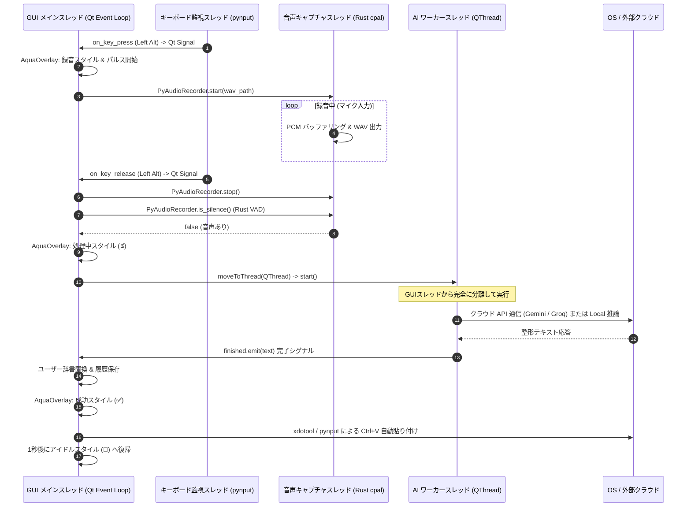

# Voice In (Linux / Cross-Platform) - システムアーキテクチャ設計書

**文書バージョン**: 1.0.0  
**作成日**: 2026-09-04  
**ステータス**: 正式承認版  

---

## 1. システムアーキテクチャ全体図

Voice In は、高水準な GUI・AI 統合を担当する **Python レイヤー** と、極低レイテンシで安全なオーディオ入出力を担当する **Rust ネイティブレイヤー** が、**PyO3 (Maturin)** を介して緊密に連携するハイブリッドアーキテクチャを採用している。

```mermaid
graph TB
    subgraph UI_Layer ["GUI & プレゼンテーション層 (PyQt6)"]
        AquaOverlay[AquaOverlay <br/> 半透明丸型フローティング & パルスアニメ]
        Tray[QSystemTrayIcon <br/> タスクトレイ常駐 & 動的アイコン生成]
        SettingsDlg[SettingsDialog <br/> 一般・プロンプト・辞書・カテゴリ設定]
        SetupWizard[SetupWizardDialog <br/> 初回導入ウィザード & モデルDL]
        HistoryDlg[HistoryDialog <br/> 履歴閲覧 & コピー]
    end

    subgraph App_Layer ["アプリケーション制御 & スレッド管理"]
        Main[src/main.py <br/> ライフサイクル & 例外ハンドラ]
        AIWorker[AIWorker : QObject <br/> QThread による非同期 AI 推論]
        KeyHook[pynput.keyboard.Listener <br/> グローバルキー監視スレッド]
    end

    subgraph Core_Layer ["コアドメイン & ユーティリティ (Python)"]
        ConfigMgr[config_manager <br/> settings.json & .env 永続化]
        WinDetector[window_detector.py <br/> xdotool / Win32 アクティブ判定]
        ContextPrompt[context_prompt.py <br/> DEV/BIZ/DOC/STD プロンプト合成]
        History[history.py <br/> 履歴追加 & 最大件数管理]
        AudioRecorder[AudioRecorder <br/> Python 音声インターフェース]
    end

    subgraph AI_Layer ["AI プロバイダ層 (Python)"]
        AIProvider[<<base>> AIProvider]
        GeminiProv[GeminiProvider <br/> google-genai SDK]
        GroqProv[GroqProvider <br/> groq SDK: Whisper + LLaMA 3.3]
        LocalProv[LocalProvider <br/> faster-whisper on CUDA/CPU]
    end

    subgraph Native_Layer ["ネイティブ音声処理コア (Rust / PyO3)"]
        PyAudioRec[PyAudioRecorder <br/> PyO3 クラスバインディング]
        CPAL[cpal <br/> クロスプラットフォームオーディオ I/O]
        Hound[hound <br/> 高速 WAV エンコード]
        RustVAD[ネイティブ VAD エンジン <br/> RMS エネルギー & Peak 判定]
    end

    subgraph OS_Layer ["OS & 外部サービス"]
        X11[X11 / xdotool <br/> ウィンドウアクティブ & Ctrl+V 注入]
        CloudGemini[Google Gemini API]
        CloudGroq[Groq Cloud API]
        FileSystem[~/.config/voice-in & ~/.local/state]
    end

    %% レイヤー連携
    Main --> AquaOverlay
    Main --> Tray
    AquaOverlay --> AudioRecorder
    AquaOverlay --> AIWorker
    AquaOverlay --> KeyHook
    AquaOverlay --> WinDetector
    AquaOverlay --> ContextPrompt

    AIWorker --> AIProvider
    AIProvider <|-- GeminiProv
    AIProvider <|-- GroqProv
    AIProvider <|-- LocalProv

    GeminiProv --> CloudGemini
    GroqProv --> CloudGroq

    AudioRecorder --> PyAudioRec
    PyAudioRec --> CPAL
    PyAudioRec --> Hound
    PyAudioRec --> RustVAD

    AquaOverlay --> X11
    ConfigMgr --> FileSystem
    History --> FileSystem
```

---

## 2. スレッドモデルと非同期通信

PyQt6 の GUI メインスレッド（描画およびアニメーションループ）を絶対にブロックさせないため、3つの独立したスレッドが稼働する。



---

## 3. なぜ Python + Rust なのか？（技術選定の核心）

1. **Python の強み（GUI & AI 連携）**:
   - PyQt6 による柔軟で美しい半透明丸型フローティングウィンドウとアニメーションの実現。
   - `google-genai`、`groq`、`faster-whisper` 等、最先端の AI SDK との親和性が最も高い。
2. **Rust の強み（低レイヤ音声処理）**:
   - Python の標準ライブラリ（PyAudio / sounddevice）では、Linux の ALSA / PulseAudio / PipeWire 環境下でのバッファアンダーランやクラッシュ、GIL によるジッターが問題になりやすい。
   - Rust の `cpal` により、ハードウェア直結のストリーミング録音と、`hound` による高速 WAV エンコーディング、および浮動小数点演算による瞬時の VAD（無音検出）を C 言語並みの超低オーバーヘッドで実行。
3. **Maturin / PyO3 によるゼロコスト抽象化**:
   - C 言語バインディングのような複雑なボイラープレート不要で、Rust の構造体 `PyAudioRecorder` を Python クラスとして直接インポート・実行可能。
