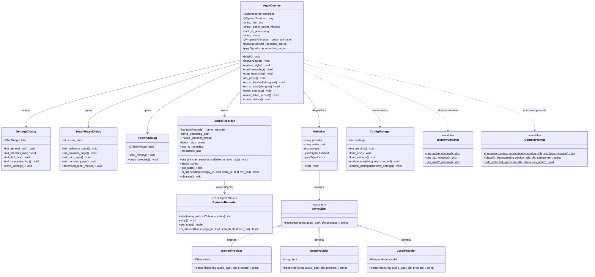

# Voice In (Linux / Cross-Platform) - クラス構造設計書 (Class Diagram)

**文書バージョン**: 1.0.0  
**作成日**: 2026-09-04  
**ステータス**: 正式承認版  

---

## 1. 全体クラス図 (Overview Class Diagram)

---

## 2. コンポーネント責務と設計原則

1. **GUI とバックエンドの完全疎結合**:
   - `AquaOverlay` は UI の描画、キーストロークイベントの受付、シグナルの発信のみを担当。
   - 音声キャプチャの詳細は `AudioRecorder`（さらにその内部の Rust ネイティブバイナリ）に隠蔽。
2. **抽象プロバイダインターフェース (`AIProvider`)**:
   - `GeminiProvider`、`GroqProvider`、`LocalProvider` は共通のインターフェース `transcribe(audio_path, prompts)` を実装しており、`AIWorker` はプロバイダの種類を意識せずに統一的に呼び出し可能。
3. **Rust ネイティブによる並列・安全な I/O**:
   - `PyAudioRecorder` は Rust の所有権モデルによりメモリリークや未定義動作を排除し、オーディオハードウェアから直接 WAV エンコードを行う。
