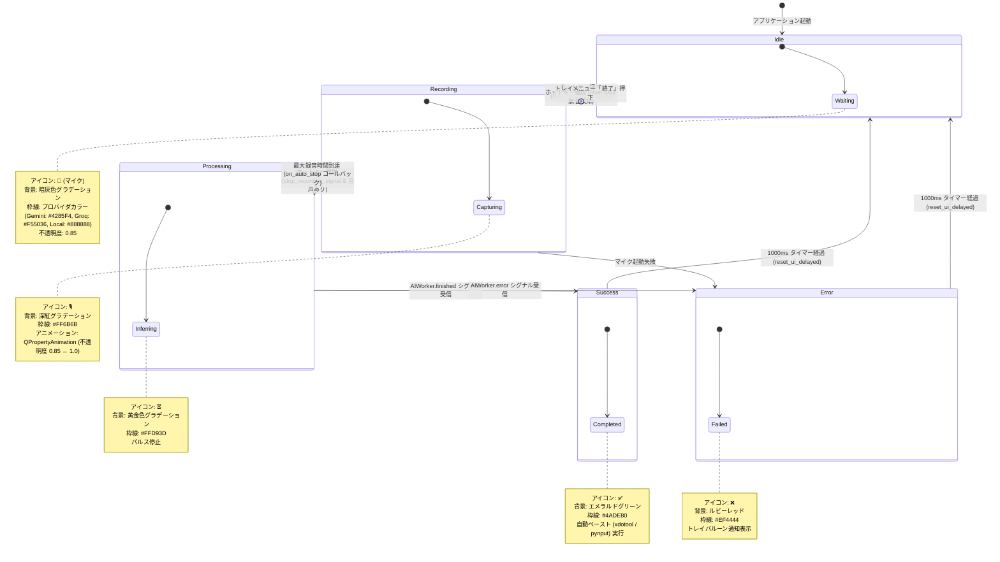

# Voice In (Linux / Cross-Platform) - データフロー図 & 状態遷移図

**文書バージョン**: 1.0.0  
**作成日**: 2026-09-04  
**ステータス**: 正式承認版  

---

## 1. UI 状態遷移図 (AquaOverlay State Machine)

デスクトップ上に常駐する丸型フローティングオーバーレイ (`AquaOverlay`) は、以下の5つの状態とスタイル（グラデーション、枠線色、アイコン、アニメーション）を遷移する。



---

## 2. データフロー図 (Data Flow Diagram: DFD)

### 2.1 レベル 0: システムコンテキスト図
```mermaid
graph LR
    User([ユーザー音声]) -->|マイク入力| VoiceIn[Voice In (Python + Rust)]
    VoiceIn -->|WAV音声 & プロンプト| AI[クラウド / ローカル AI <br/> Gemini / Groq / Local]
    AI -->|整形済みテキスト| VoiceIn
    VoiceIn -->|xdotool / pynput| TargetApp([アクティブウィンドウ <br/> VSCode / Slack / ターミナル等])
```

---

### 2.2 レベル 1: 詳細処理パイプライン DFD

```mermaid
flowchart TD
    subgraph AudioCapture ["1. ネイティブ音声録音 & VAD (Rust)"]
        Mic[マイク入力] --> CPAL[cpal ストリーム]
        CPAL --> WAVWriter[hound WAV エンコーダ]
        WAVWriter --> TempWav[(一時 WAV ファイル <br/> /tmp/tmp*.wav)]
        CPAL --> VADCalc[Rust VAD: RMS & Peak 計算]
        VADCalc --> SilenceCheck{無音判定 <br/> is_silence?}
    end

    SilenceCheck -->|Yes: 無音・短時間| Discard[WAV 削除 & キャンセル]
    SilenceCheck -->|No: 有効音声| ContextCapture

    subgraph ContextOptimization ["2. コンテキスト認識 & プロンプト合成"]
        ActiveWin[アクティブウィンドウ] --> WinDetect[window_detector.get_active_window]
        WinDetect --> AppCategory{カテゴリ分類}
        AppCategory -->|DEV| DevP[開発プロンプト: コード変数・英語化]
        AppCategory -->|BIZ| BizP[ビジネスプロンプト: 敬語・改行]
        AppCategory -->|DOC| DocP[文書プロンプト: 書き言葉・Markdown]
        AppCategory -->|STD| StdP[標準プロンプト: フィラー除去]
    end

    ContextCapture --> PromptCompose[プロンプト合成エンジン]
    DevP --> PromptCompose
    BizP --> PromptCompose
    DocP --> PromptCompose
    StdP --> PromptCompose

    subgraph AIWorkerPipeline ["3. AI 推論 & テキスト整形"]
        PromptCompose --> Worker[AIWorker (QThread)]
        TempWav --> Worker
        Worker --> ProvRouter{プロバイダ分岐}

        ProvRouter -->|Gemini| GeminiRun[google-genai generate_content]
        ProvRouter -->|Groq| GroqWhisper[groq audio.transcriptions]
        GroqWhisper --> GroqRefine[groq chat.completions LLaMA 3.3]
        ProvRouter -->|Local| LocalRun[faster-whisper ctranslate2]

        GeminiRun --> RawText[文字起こし結果]
        GroqRefine --> RawText
        LocalRun --> RawText
    end

    subgraph OutputPipeline ["4. 辞書置換 & 自動貼り付け"]
        RawText --> DictReplace[辞書置換: settings.json]
        DictReplace --> FinalText[確定テキスト]
        FinalText --> SaveHistory[(history.json 保存)]
        FinalText --> Clipboard[QApplication.clipboard.setText]
        Clipboard --> TargetPaste[xdotool windowactivate & key ctrl+v]
        TargetPaste --> TargetAppInput[アクティブアプリへ直接入力]
    end
```
