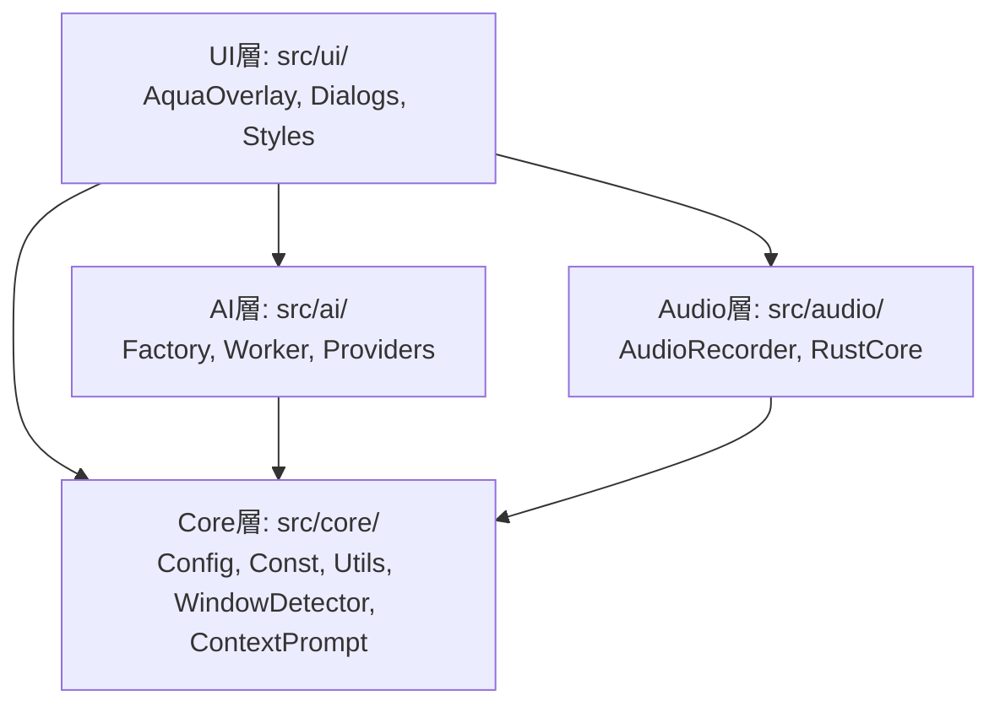
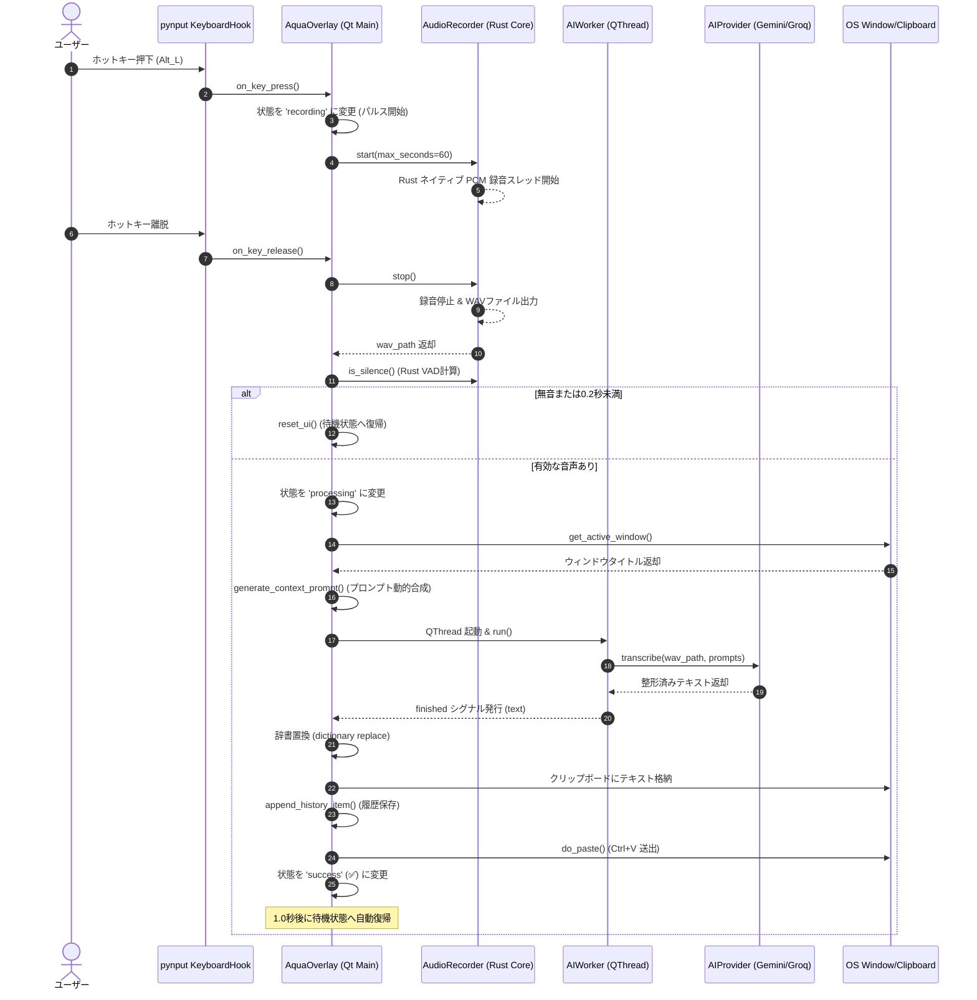

# Voice In - 詳細設計書 (Detailed Design Document)

**文書バージョン**: 1.0.0  
**作成日**: 2026-09-09  
**対象コンポーネント**: 全モジュール (`src/core`, `src/ai`, `src/audio`, `src/ui`)  

---

## 1. モジュール構成と責務分担

Voice In は関心事の分離（Separation of Concerns）に基づき、4つの層に分離されている。



| 層 | モジュール | 主な責務・クラス |
| :--- | :--- | :--- |
| **Core** | `const.py` | 定数、既定モデル名、既定プロンプト、カテゴリ定義の集約（SSOT） |
| | `config.py` | `ConfigManager`: 設定ファイル（`settings.json`）と環境変数（`.env`）の読込・保存・ディープマージ |
| | `utils.py` | OS別パス解決（Windows/macOS/Linux）、ISO日時生成、辞書マージ |
| | `context_prompt.py` | ウィンドウタイトルからのカテゴリ判定（単語境界マッチ）、プロンプト動的合成 |
| | `window_detector.py` | Win32 API (`ctypes`) / AppleScript / `xdotool` によるアクティブウィンドウ検知 |
| | `history.py` | 履歴ファイルの読込・アトミック保存・直近50件クリッピング |
| | `i18n.py` | 5言語対応の翻訳キー解決・プレースホルダーフォーマット |
| **AI** | `factory.py` | `get_provider(name)`: プロバイダのインスタンス生成・バリデーション |
| | `worker.py` | `AIWorker(QObject)`: `QThread` 上での非同期推論・シグナル発行 |
| | `providers/base.py` | `AIProvider(ABC)`: 音声認識プロバイダの抽象基底クラス |
| | `providers/gemini.py`| `GeminiProvider`: `google-genai` SDK による直接バイナリ推論 |
| | `providers/groq.py` | `GroqProvider`: Whisper (認識) ＋ LLaMA (整形) の2段階推論 |
| | `providers/local.py` | `LocalProvider`: `faster-whisper` によるオフラインローカル推論 |
| **Audio**| `recorder.py` | `AudioRecorder`: Rust ネイティブ (`PyAudioRecorder`) の制御、録音監視スレッド |
| | `vad.py` | 補助的な簡易 VAD クラス |
| **UI** | `overlay.py` | `AquaOverlay(QMainWindow)`: メインコントローラ、キー監視、状態マシン、ペースト制御 |
| | `styles.py` | ダイアログ共通の Qt Style Sheet (QSS) 定義 |
| | `settings.py` | `SettingsDialog`: 5タブ詳細設定画面 |
| | `setup.py` | `SetupWizardDialog`: 5ステップ初期導入ウィザード |
| | `history.py` | `HistoryDialog`: 履歴検索・プレビューダイアログ |
| | `widgets.py` | トレイアイコンの動的 QPixmap 描画ユーティリティ |

---

## 2. 処理シーケンス & ロジック詳細

### 2.1 音声入力〜自動貼付のエンドツーエンドシーケンス



---

## 3. コンテキスト認識 & プロンプト合成アルゴリズム

### 3.1 単語境界マッチング (`src/core/context_prompt.py`)
単純な `keyword in title` では、例えば BIZ キーワード `"meet"` が `"Meeting Notes"`（DOC系）に誤判定される不具合が発生する。
これを解決するため、英数字キーワードには**正規表現の単語境界（否定戻り読み・否定先読み）**を適用する。

$$\text{Pattern} = \text{`(?<![a-zA-Z0-9])`} + \text{keyword} + \text{`(?![a-zA-Z0-9])`}$$

```python
def _matches_keyword(keyword: str, title_lower: str) -> bool:
    kw = keyword.strip().lower()
    if not kw:
        return False
    if re.match(r'^[a-zA-Z0-9_\-]+$', kw):
        pattern = r'(?<![a-zA-Z0-9])' + re.escape(kw) + r'(?![a-zA-Z0-9])'
        return bool(re.search(pattern, title_lower))
    # 日本語キーワード（例: "メモ"）は部分一致
    return kw in title_lower
```

### 3.2 カテゴリ優先度
ウィンドウタイトルに対し、以下の順序で最初にマッチしたカテゴリを採用する。
1. **`DEV`** (開発・ターミナル・エディタ)
2. **`BIZ`** (メール・チャット・会議ツール)
3. **`DOC`** (文書作成・Wiki・メモ帳)
4. **`STD`** (標準フォールバック)

---

## 4. スレッドモデル & 並行処理設計

GUI の 60fps スムーズなアニメーション（パルス効果・ドラッグ）を担保するため、4 つのスレッドが協調動作する。

```
[ スレッド 1: Qt メインスレッド (GUI) ]
  ├── イベントループ、UI描画、アニメーション (QPropertyAnimation)
  ├── pynput キーフックからのシグナル受信
  └── タイマー制御 (QTimer)

[ スレッド 2: キーボード監視スレッド (pynput) ]
  └── OS 低レベルフック (X11 / Win32 Hook) からの押下・離脱検知

[ スレッド 3: 音声監視スレッド (threading.Thread) ]
  └── 最大録音時間 (max_seconds) のカウントとタイムアウト時の auto_stop 発行

[ スレッド 4: AI 推論非同期スレッド (QThread) ]
  └── AIWorker によるネットワーク通信 (Gemini / Groq API)
      ※ 完了時に Qt Signal でメインスレッドへ安全に結果受け渡し

[ ネイティブスレッド: Rust cpal Audio Capture ]
  └── ハードウェア PCM バッファ取得、リングバッファ格納、WAV エンコード
```

---

## 5. 例外処理 & エラーリカバリ設計

| 障害シナリオ | 発生箇所 | 検出方法 | リカバリ動作・ユーザー影響 |
| :--- | :--- | :--- | :--- |
| **API キー未設定 / 認証エラー** | `GeminiProvider` / `GroqProvider` | HTTP 401 / SDK 初期化例外 | オーバーレイに ❌ 表示、トレイに「APIキーを確認してください」と通知、設定画面への誘導。 |
| **ネットワーク切断 / タイムアウト** | `AIWorker` | `requests` / SDK 接続例外 | タイムアウト時に ❌ 表示。一時 WAV を削除し、トレイに通信エラー通知。アプリ常駐は維持。 |
| **外部 SDK 未インストール** | `factory.py` | `ImportError` | モジュール読込時はクラッシュさせず、プロバイダ初期化時に明確なインストール案内メッセージをログ出力。 |
| **RustCore 未ビルド** | `recorder.py` | `ImportError` | `RUST_CORE_AVAILABLE = False` で保護し、クラス初期化時に `maturin develop` の実行案内を明示。 |
| **無音・マイク誤作動** | `AudioRecorder` | `is_silence()` (RMS/Peak) | API 通信を発生させずにローカルで静かに破棄。無駄な課金と待機時間をゼロにする。 |
| **貼り付け失敗** | `overlay.py` | `do_paste()` 内例外 | クリップボードへのテキスト格納は完了しているため、ユーザーは手動 `Ctrl+V` で救出可能。 |
