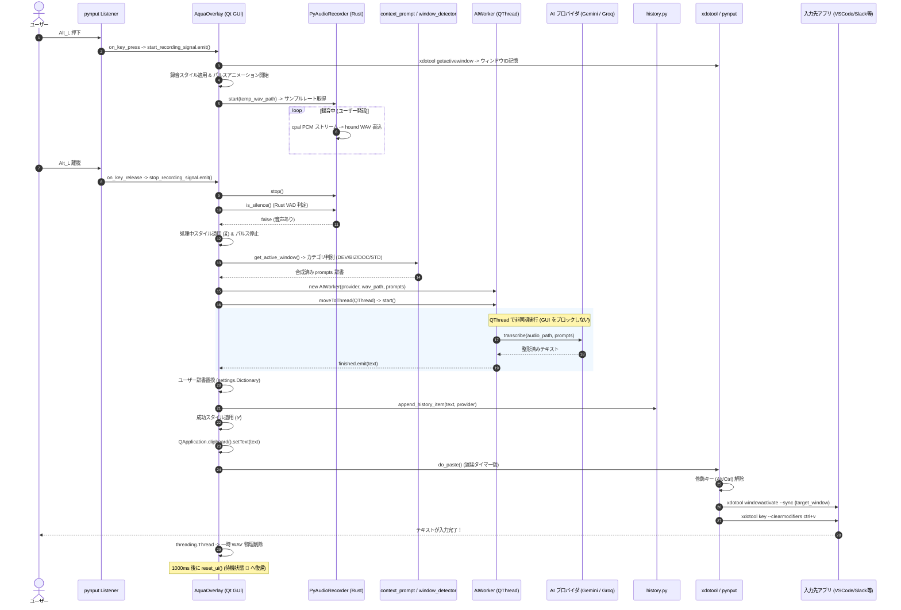
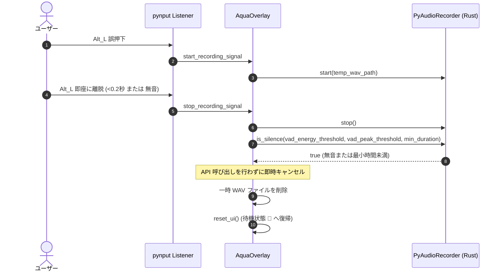
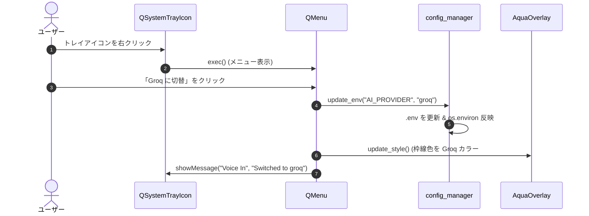
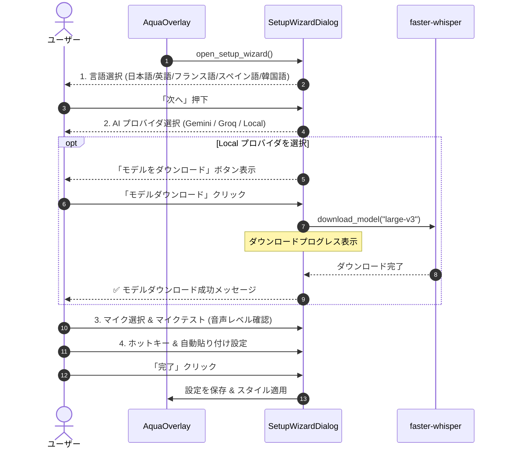

# Voice In (Linux / Cross-Platform) - シーケンス図集

**文書バージョン**: 1.0.0  
**作成日**: 2026-09-04  
**ステータス**: 正式承認版  

---

## 1. メイン処理フロー: 音声録音・AI推論・自動貼り付け (正常系)

---

## 2. Rust ネイティブ VAD による無音自動キャンセル

キーの誤タッチや極めて短い発話（0.2秒未満）、または無音の場合に、無駄な API 課金や遅延を防止するフロー。

---

## 3. タスクトレイからのプロバイダ即時切替

---

## 4. 初回セットアップウィザード & Local モデルダウンロード

初回起動時、またはメニューから起動される対話型ウィザードのフロー。

