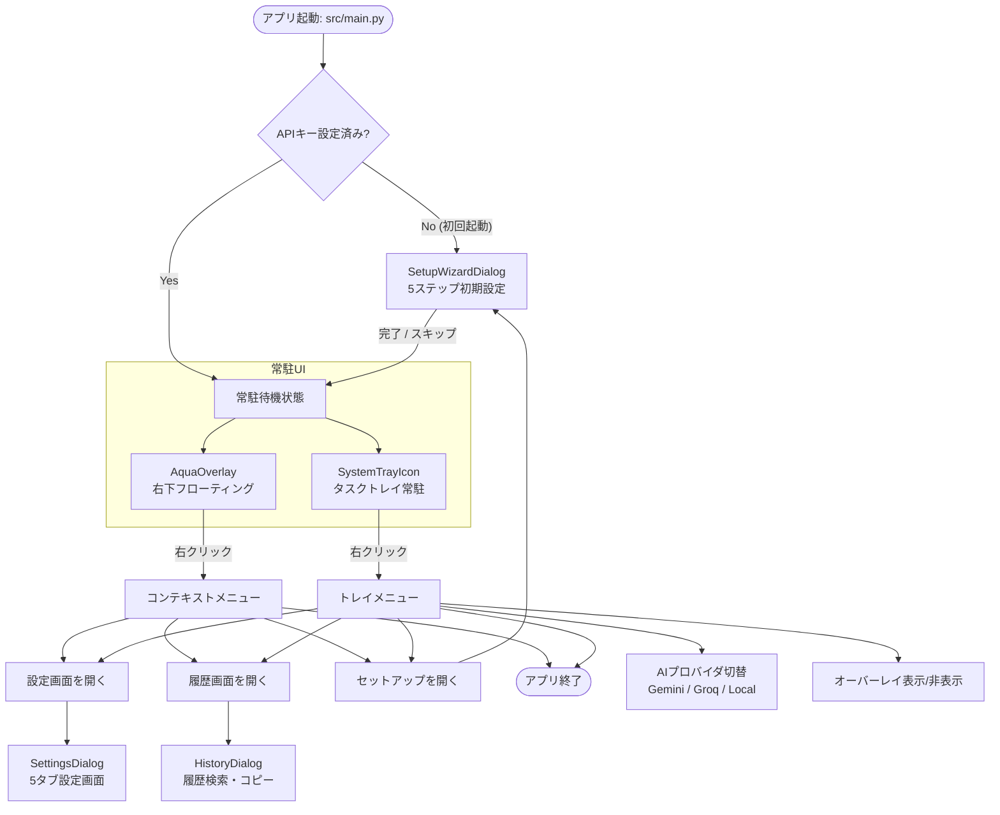
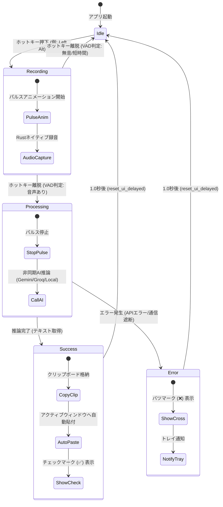
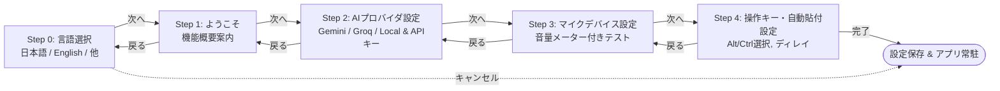

# Voice In - 画面遷移 & UI/UX 設計書

**文書バージョン**: 1.0.0  
**作成日**: 2026-09-09  
**対象コンポーネント**: `src/ui/` (`overlay.py`, `settings.py`, `setup.py`, `history.py`, `widgets.py`, `styles.py`)  

---

## 1. UI/UX コンセプト

### 1.1 アンビエント & ゼロクリック体験
- **作業コンテキストを阻害しない**: 従来のツールのように「アプリ画面を開いて録音ボタンをクリックする」という行為を排除。ユーザーがエディタやブラウザで作業しているそのままの状態で、キー長押しだけで即時入力できる。
- **視覚的フィードバック（常時最小・必要な時だけ明瞭）**: 画面右下に常駐する透過サークル（`AquaOverlay`）が、待機・録音中・推論中・完了・エラーをアニメーションと色彩で直感的に伝える。

---

## 2. 画面・ダイアログ構成一覧

| 画面 / コンポーネント | 種別 | トリガー | 主な役割 |
| :--- | :--- | :--- | :--- |
| **AquaOverlay** | 常駐フローティング | アプリ起動時 | 状態表示（マイク・砂時計・チェック・バツ）、パルスアニメーション、ドラッグ移動 |
| **SystemTrayIcon** | 常駐トレイ | アプリ起動時 | トレイ状態色表示、プロバイダ即時切替、各ダイアログ呼び出し |
| **SettingsDialog** | モーダルダイアログ | トレイ / オーバーレイ右クリック | 一般設定、AIプロバイダ、プロンプト編集、辞書、アプリカテゴリ、履歴管理 |
| **SetupWizardDialog** | ウィザードダイアログ | 初回起動時 / トレイから起動 | 初期セットアップ（言語、APIキー、マイクテスト、LocalモデルDL） |
| **HistoryDialog** | モーダルダイアログ | トレイ / オーバーレイ右クリック | 過去50件の文字起こし結果の閲覧、全文検索、クリップボードコピー |

---

## 3. 全体画面遷移図



---

## 4. AquaOverlay 状態遷移設計 (State Machine)

`AquaOverlay` は、音声入力のライフサイクルに合わせて 5 つの状態を遷移し、ユーザーにリアルタイムの視覚フィードバックを提供する。



### 状態別 UI 仕様

| 状態名 | アイコン | 背景グラデーション | 枠線色 | トレイアイコン色 | 挙動・アニメーション |
| :--- | :---: | :--- | :--- | :---: | :--- |
| **Idle** (待機) | 🎤 | 暗灰色（半透明） | プロバイダ色 | 🟢 緑 (#2ecc71) | マウスホバーで不透明度 0.85 → 0.95 |
| **Recording** (録音中) | 🎙️ | 深紅グラデーション | 明るい赤 (#ff6b6b) | 🔴 赤 (#dc143c) | 不透明度 0.85 ⇔ 1.0 のパルスアニメーション |
| **Processing** (推論中) | ⏳ | 黄金色グラデーション | 鮮黄色 (#ffd93d) | 🟡 黄 (#ffc107) | パルス停止、待機アニメーション |
| **Success** (成功) | ✅ | エメラルドグリーン | 明緑色 (#4ade80) | 🟢 緑 (#2ecc71) | 1秒間表示後、待機状態へ自動復帰 |
| **Error** (エラー) | ❌ | 暗赤色グラデーション | 赤色 (#ef4444) | 🟣 赤紫 (#b00020) | 1秒間表示後、トレイにエラー要約通知 |

---

## 5. 各ダイアログの詳細画面遷移 & 操作フロー

### 5.1 セットアップウィザード (`SetupWizardDialog`)
初回起動時、5 つの画面をステップ・バイ・ステップで遷移する。



### 5.2 設定ダイアログ (`SettingsDialog`)
5 つのタブで構成され、詳細なカスタマイズを提供する。

```
[Voice In 設定] ------------------------------------------------------------------
| [一般] | [プロンプト] | [辞書] | [カテゴリ] | [履歴] |
|--------------------------------------------------------------------------------
| (一般タブ)
|  🤖 AI Provider & Model: [ Gemini ▼ ]
|     Gemini モデル: [ gemini-2.0-flash         ]
|     Gemini API Key: [ ********************  ] [👁️]
|  🎙️ オーディオ設定:
|     入力デバイス: [ 既定のマイク ▼ ]
|     マイク音量テスト: [████████████░░░░░░] [テスト開始]
|  ⌨️ 操作・貼り付け設定:
|     録音キー: [ Left Alt ▼ ]  最大録音: [ 60 ] 秒
|     [✔] 自動貼り付け (Auto Paste)   貼り付け遅延: [ 200 ] ms
|  🌐 言語設定: [ 日本語 (ja) ▼ ]
|--------------------------------------------------------------------------------
|                                            [ 保存して適用 ]  [ 閉じる ]        |
---------------------------------------------------------------------------------
```

- **タブ 1: 一般 (General)**: プロバイダ選択、APIキー管理、マイクデバイス選定＆ゲイン、録音キー、自動貼付ディレイ
- **タブ 2: プロンプト (Prompts)**: 各社AIプロバイダ向けの基本プロンプトテンプレートの編集
- **タブ 3: 辞書 (Dictionary)**: 誤変換しやすい専門用語や社内用語の確定前一括置換ルール管理
- **タブ 4: カテゴリ (Categories)**: `DEV` / `BIZ` / `DOC` / `STD` のキーワード割り当て、検出済みアプリ一覧からの即時マッピング
- **タブ 5: 履歴 (History)**: 直近50件の文字起こしログ、全文検索、内容コピー

### 5.3 履歴ダイアログ (`HistoryDialog`)
- 上部検索バーに文字を入力すると、インクリメンタルサーチ（日時・プロバイダ・認識本文・エラー）でリアルタイムに絞り込み。
- 表行をクリックすると、下部詳細ビューにタイムスタンプ・プロバイダ・全文が整形表示される。
- `コピー` ボタン押下でクリップボードに一発コピー。
