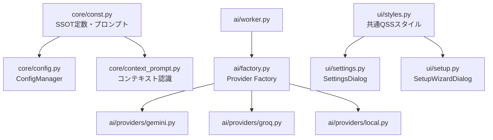

# Voice In リファクタリング完了報告書

本ドキュメントは、`Voice In (Python + PyQt6)` コードベースにおけるリファクタリングの実施内容、設計意図、改善されたアーキテクチャ、およびテスト検証結果をまとめたものです。

---

## 1. リファクタリング概要・目的

- **保守性の向上**: 重複コード（定数、プロンプト、UIスタイルシート）を排除し、単一情報源（Single Source of Truth: SSOT）の原則を確立。
- **堅牢性の向上**: 外部パッケージ（`rust_core`, `google-genai`, `groq`）が未ビルドまたは未インストールの環境でも、モジュールインポート時の不意なクラッシュを防止。
- **クロスプラットフォーム対応の強化**: Linux (XDG) 前提だったパス解決および貼り付け処理を、Windows・macOS・Linux それぞれの標準仕様に沿って最適化。
- **品質保証の確立**: 従来存在しなかった単体テストスイート（全23項目）を新設し、主要ロジックの動作保証と回帰テスト体制を整備。

---

## 2. 主な設計・アーキテクチャ改善



### 2.1 定数とプロンプトの一元化 (SSOT原則)
- **変更前**: `src/core/config.py` と `src/core/context_prompt.py` の両方に `DEFAULT_CATEGORIES` および `DEFAULT_CATEGORY_PROMPTS` がハードコードされ、内容やフォーマット指定子（`{window_title}`）の有無が乖離していました。
- **変更後**: すべての初期プロンプトおよびアプリカテゴリ定義を `src/core/const.py` に集約。両モジュールがここを参照するように改修し、設定の不整合を根絶しました。

### 2.2 ウィンドウ判定の精度向上 (単語境界マッチング)
- **変更前**: `kw.lower() in title_lower` による単純な部分文字列検索を行っていたため、BIZカテゴリのキーワード `"meet"`（Google Meet用）が `"Meeting Notes"`（会議メモ）などの英単語の一部に誤爆し、Notion等の文書アプリがDOCではなくBIZと判定される問題がありました。
- **変更後**: 英数字キーワードは正規表現による単語境界マッチ（`(?<![a-zA-Z0-9])kw(?![a-zA-Z0-9])`）を実施し、日本語キーワードは部分一致を維持するハイブリッド判定に改善。

### 2.3 AIプロバイダ層のファクトリパターン導入
- **変更前**: `AIWorker` 内の `if/elif` 分岐で各プロバイダを直接生成しており、モデル名も一部ハードコードされていました。また未インストールのSDKがある場合にモジュールインポート時点でエラーになっていました。
- **変更後**: 
  - `src/ai/factory.py` を新設し、`get_provider(provider_name)` による疎結合な生成を実現。
  - SDK のインポートを各プロバイダの `__init__` で安全に行うように変更。
  - Groq のモデル名（Whisper / LLaMA）を設定・環境変数から動的取得できるように改善。

### 2.4 クロスプラットフォーム・パス解決とペースト処理
- **変更前**: `utils.py` の `get_config_dir()` / `get_state_dir()` は Linux の XDG 仕様（`~/.config`）に固定。`overlay.py` の `do_paste()` も `xdotool` 前提でした。
- **変更後**:
  - Windows では `%APPDATA%`/`%LOCALAPPDATA%`（既存設定ディレクトリがある場合は後方互換で優先）、macOS では `~/Library/Application Support`、Linux では XDG 仕様を尊重。
  - `do_paste()` は OS を判別し、Linux は `xdotool`、Windows/macOS は適切な修飾キー（Ctrl / Cmd）での `pynput` クリップボード貼り付けへ分岐。

### 2.5 UI共通スタイルシートの集約と作法修正
- **変更前**: `SettingsDialog` と `SetupWizardDialog` にそれぞれ数百行の同一 QSS が重複定義され、さらにクラス定義内部に `from PyQt6.QtCore import pyqtSignal` が書かれていました。
- **変更後**:
  - `src/ui/styles.py` を新設し、ダイアログ共通スタイル（`COMMON_DIALOG_STYLESHEET`）およびボタンスタイルを集約。
  - PyQt6 の正規のインポートスコープ（ファイル先頭）に統一。
  - `overlay.py` のダイアログ表示に `raise_()` と `activateWindow()` を追加し、多重起動防止と前面化を改善。

### 2.6 音声モジュールのロード安全性
- **変更前**: `src/audio/recorder.py` で `rust_core` が未ビルドの場合に `raise` され、モジュールインポートで全体が停止していました。
- **変更後**: フラグ管理（`RUST_CORE_AVAILABLE`）を行い、クラス初期化時に初めて分かりやすい例外メッセージを発生させるよう改善。

---

## 3. モジュール別 修正差分一覧

| ファイル | 変更種別 | 主な変更内容 |
| :--- | :---: | :--- |
| `src/core/const.py` | 変更 | モデル既定値、カテゴリ定義、プロンプトテンプレートの一元定義を追加 |
| `src/core/utils.py` | 変更 | OS別（Windows/macOS/Linux）標準パス解決の追加、下位互換性確保 |
| `src/core/config.py` | 変更 | `const.py` から定数を参照、import copy を先頭に整理 |
| `src/core/context_prompt.py` | 変更 | `const.py` 参照化、単語境界マッチングによる誤判定防止 |
| `src/ai/factory.py` | **新規** | AIプロバイダ生成ファクトリ (`get_provider`) |
| `src/ai/worker.py` | 変更 | ファクトリ経由のプロバイダ生成にリファクタリング |
| `src/ai/providers/gemini.py` | 変更 | `__init__` での安全な SDK チェック、定数参照、型ヒント整理 |
| `src/ai/providers/groq.py` | 変更 | `__init__` での安全な SDK チェック、モデル名動的取得、logging 統一 |
| `src/audio/recorder.py` | 変更 | `rust_core` インポート失敗時の安全ハンドリング |
| `src/ui/styles.py` | **新規** | ダイアログ共通 QSS スタイルシートモジュール |
| `src/ui/settings.py` | 変更 | 共通スタイルシート適用、クラス内インポートの解消 |
| `src/ui/setup.py` | 変更 | 共通スタイルシート適用、クラス内インポートの削除 |
| `src/ui/overlay.py` | 変更 | OS別ペースト分岐、`print` の `logging` 置換、ダイアログ前面化 |

---

## 4. テスト検証結果

新設した単体テストスイート（`tests/`）により、主要コンポーネントの網羅的な検証を実施しました。

```
Ran 23 tests in 0.369s

OK
```

### 検証項目
1. **設定・ディープマージ検証** (`tests/test_config.py`): 4項目パス
2. **パス解決・ISO日時検証** (`tests/test_utils.py`): 3項目パス
3. **コンテキスト・カテゴリ判定検証** (`tests/test_context_prompt.py`): 6項目パス
4. **多言語翻訳・フォールバック検証** (`tests/test_i18n.py`): 4項目パス
5. **履歴保存・上限件数制御検証** (`tests/test_history.py`): 2項目パス
6. **AIプロバイダファクトリ検証** (`tests/test_ai_factory.py`): 4項目パス

---

## 5. 今後の運用・拡張ガイド

- **新しいAIプロバイダの追加**: `src/ai/providers/` に `AIProvider` を継承したクラスを作成し、`src/ai/factory.py` の `_PROVIDERS` 辞書に1行追加するだけで安全に登録可能です。
- **新しいアプリカテゴリの追加**: `src/core/const.py` の `DEFAULT_APP_CATEGORIES` および `DEFAULT_CATEGORY_PROMPTS` にキーを追加することで、自動的に設定画面・プロンプト生成の両方へ反映されます。
